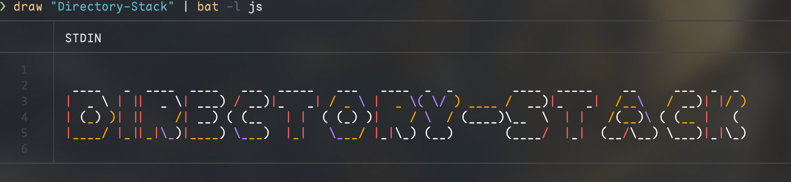

# Write-Big-Char

> **Attention**: all functions are compeled by [:link:here](https://github.com/fleschutz/PowerShell/blob/master/Scripts/write-big.ps1), I just pack it as a module to make users install it easily

## :beginner: Function

- make the string your input bigger in powershell, just this

## :gear: Install and Uninstall

- install: `Install-Module -Name Write-Big-Char`
- uninstall: `Uninstall-Module -Name Write-Big-Char`

## :toolbox: Usage

- The api exported to powershell is `Write-Big-Char`
- for use easily, suggest to alias this to `draw` or other commands you like
- `Set-Alias -Name draw Write-Big-Char`, put this line to your powershell `$PROFILE`
